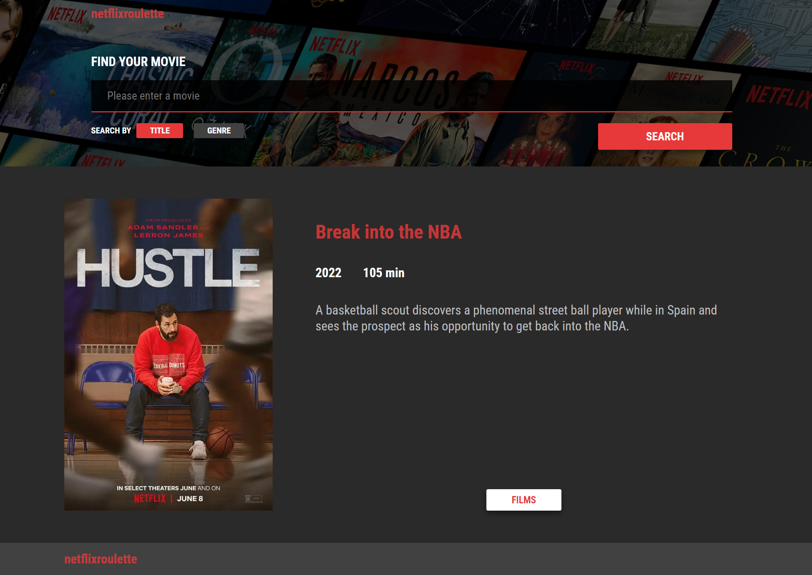

## (P - project) REACT / App Netflix Roulette

Created - login form, registration form, search form, movie list, info card, sort-toggle cards<br/>
Used - TypeScript, React, Redux Toolkit, React Final Form, Webpack, Jest, React Testing Library

<div>
  ## Info card
  
  ## Main page
  
  ## Registration form
  
  ## Login form
  
</div>


## Project setup
```
npm install
```

### Compiles and hot-reloads for development
```
npm start
```

### Compiles and minifies for production
```
npm run build
```

### Run verification tests
```
npm run test
```
